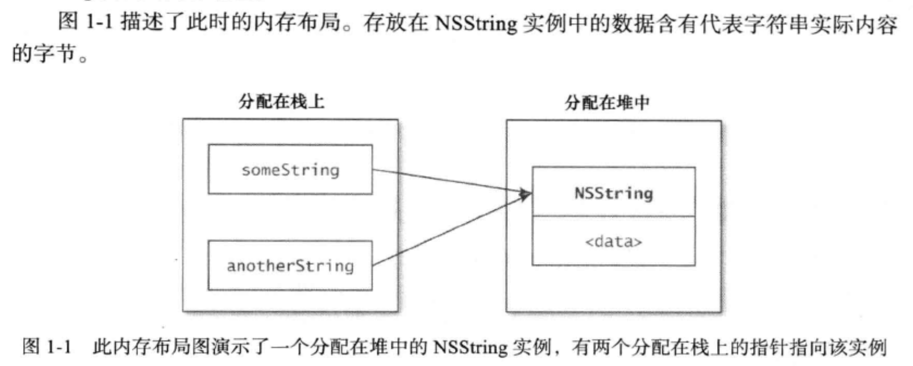

# iOS理论 I
1. **isa指针：**     
	isa指针是一个只想所属类的指针，它标注着实例对象的真实类型（也就是说通过isa指针来确定当前对象的类型）。
2. **imp指针：**    
	imp是implementation的缩写，imp指针是只想selector的具体实现的指针（通过imp指针找到方法）。
3. **内存泄漏：**    
	开辟的空间在使用完毕之后没有被释放，结果导致一只占据该内存单元，不能再次被调用，直到程序结束运行（循环引用是导致内存泄漏的主要原因，包括delegate和block）。
4. **内存溢出：**    
	每个设备都有一定的内存，iOS系统给每个程序分配了固定的内存，用于程序的运行（iPhone5s在80M左右）。简单来说，内存溢出就是在程序运行过程中如果一次需要读取的数据超过这个栈的内存的大小就会出现溢出，所以一般内存管理中，在对象使用完毕之后都会释放掉。
5. **野指针：**    
	对象内存空间已经被系统回收，但仍然使用指针操作这块内存（野指针是导致程序crash的主要原因之一）。
6. **frame：**    
	视图的frame，bounds和center属性仅仅是存取方法，当操纵视图的frame是，实际上是在改变位于视图下方的CALayer的frame，不能够独立于图层之外改变视图的frame（也就是说我们平时在设置视图的frame时，实际上是在设置view.layer的frame）。
7. **给圆角添加阴影的方法：**    
	maskToBounds会裁掉超出边界的所有内容，所以如果需要给maskToBounds = YES的layer添加阴影，一般需要单独添加一个图层。
8. **当视图在做动画时（比如UIView的animation动画），如何实时获取视图的frame？**    
	可以通过layer的presentationLayer属性，如view.layer.presentationLayer.frame，同样，如果要想实时获取正在动画过程中的CALayer对象的frame，则可以使用layer.presentationLayer.frame这种方式。
9. **@property 后面可以有哪些修饰符？**    

	修饰符名称 | 修饰符
	---------|-------------------
	读写性修饰符 | readwrite/readonly
	setter相关修饰符 | assign/retain/copy
	原子性修饰符 | atomic/nonatomic
	getter和setter修饰符 | @property (getter=getMethodName, setter=setMethodName) Object *obj;
10. **weak变量自动置空如何实现？**
	runtime对注册的类会进行自动布局，对于weak对象会放入一个hash表中。用weak指向的对象内存地址作为key，当引用计数为0时会dealloc，假如weak指向的对象内存地址是a，那么就会以a为key，在这个weak表中搜索，找到以a为key的weak对象，从而置为nil。
11. **void *与id有什么区别？**
	类型为void的指针代表对象的地址，而不是类型，而id是动态类型，和void *是有区别的（void *返回指向void的指针，可以转换为任何数据类型）。简单来说就是void *是一个void类型的指针，而id则是动态类型。
12. **OC中的对象内存分配在堆上还是栈上？如何进行管理？**
	* OC中所有的对象所占内存总是分配在“堆空间”（head space），而决不会分配在“栈”（stack）上。
	* 分配在堆中的内存必须直接管理，而分配在站上用于保存变量的内存则会在其栈帧弹出时自动清理。
	* 在OC代码中，有时会遇到定义不含*的变量，它们可能会使用“栈空间”（stack space）。这些变量保存的不是OC对象，如CGRect，如果改用OC对象来做的话，性能会受影响。与创建结构体相比，创建对象还需要额外开销，例如分配及释放堆内存等。如果只需要保存int、float等非对象类型，那么通常使用CGRect这种结构体就行了。
13. **OC中常见的内存布局**    
	```
	NSString *someString = @"The string";
	NSString *anotherString = someString;
	```
	
14. **static NSTimeInterval const kAnimationDuration = 0.5f;其中static关键字的作用是什么？**
	static关键字是限制kAnimationDuration这个变量的编译范围的，防止这个变量所在文件被其他文件引入后成为全局变量。
15. **绝不应该在init或dealloc方法中调用存取方法（setter、getter）。**
16. **KVC和KVO的实现原理是什么？**
	[http://m.blog.csdn.net/article/details?id=9674431](http://m.blog.csdn.net/article/details?id=9674431)
	[http://blog.csdn.net/kesalin/article/details/8194240](http://blog.csdn.net/kesalin/article/details/8194240)
	KVC在某种程度上提供了访问器的替代方案。不过访问器方法是一个很好的东西，以至于只要有可能，KVC也尽量在访问器方法的帮助下工作。为了设置或者返回对象属性，KVC按顺序使用如下技术：
	* 检查是否存在名为-key、-isKey（只针对布尔值有效）或者-getKey的访问器方法，如果有可能，就使用这些方法返回值；    
		检查是否存在名为-setKey:的方法，并使用它做设置值（对于-getKey和-setKey:方法，将大写key字符串的第一个字母，并与Cocoa的方法命名保持一致）；
	* 如果上述方法不可用，则检查名为-_key、-_isKey（只针对布尔值有效）、-_getKey和-_setKey:方法；
	* 如果没有找到访问器方法，可以尝试直接访问实例变量。实例变量可以是名为：key或者_key；
	* 如果仍未找到，则调用valueForUndefinedKey:和setValue:forUndefinedKey:方法。这些方法的默认实现都是抛出异常，我们可以根据需要重写它们。
17. **字典的实现原理是什么？**
	[https://bestswifter.com/dictionary-implemation/](https://bestswifter.com/dictionary-implemation/)
18. **数据存储，CoreData、SQLite、NSUserDefaults及plist（通过archive）等，特点及区别是什么？**
	[http://www.jianshu.com/p/706ab105f2f2](http://www.jianshu.com/p/706ab105f2f2)
19. **block的实现原理是什么？**
	[http://www.jianshu.com/p/ca6ac0ae93ad](http://www.jianshu.com/p/ca6ac0ae93ad)
	clang编译之后，可以发现，编译之后的结果，有一个大结构体__main_block_impl_0，这个结构体包含__block_impl和__main_block_desc_0两个结构体，和一个结构体构造函数__main_block_impl_0（这个构造函数和结构体同名），用来初始化这个大结构体，而block其实就是指向__main_block_impl_0这个大结构体的结构体指针。
	
	当block持有变量时：
	* 如果没有__block关键字修饰变量，这种情况是值引用，在block中该变量不可被修改，因为block中的变量其实是另一个变量；
	* 如果有__block关键字修饰变量，这种情况是地址引用，在block中其值可以被修改；

	```
	#pragma mark - 没有__block关键字修饰变量的情况下
	int main() {
		int i = 6;
		void (^block)() = ^(){
			printf("i = %d", i); // i = 6
		};
		i ++;
		block();
		return 0;
	}
	
	// clang编译后
	struct __main_block_impl_0 {
		struct __block_impl impl;
		struct __main_block_desc_0* Desc;
		int i; // 注意这里，这个变量用来保存main函数的变量i
    	__main_block_impl_0(void *fp, struct __main_block_desc_0 *desc, int _i, int flags=0) : i(_i) {
			impl.isa = &_NSConcreteStackBlock;
			impl.Flags = flags;
			impl.FuncPtr = fp;
			Desc = desc;
		}
	};
	
	// 在执行block时，取出的i为__main_block_impl_0保存的值，这两个变量不是同一个；这就是为什么我们执行了i ++操作，再执行block，i的值仍然不变的原因；
	
	#pragma makr - 使用__block关键字修饰变量的情况下
	int main() {
		__block int i = 6;
		void (^block)(void) = ^(){printf("i = %d", i);};
		i ++;
		block();
		return 0;
	}

	// clang编译后
	// 新增加的结构体，通过这个结构体来
	struct __Block_byref_i_0 {
		void *__isa;
		__Block_byref_i_0 *__forwarding;
		int __flags;
		int __size;
		int i;
	};

	struct __main_block_impl_0 {
		struct __block_impl impl;
		struct __main_block_desc_0* Desc;
		__Block_byref_i_0 *i; // 注意这里
		__main_block_impl_0(void *fp, struct __main_block_desc_0 *desc, __Block_byref_i_0 *_i, int flags=0) : i(_i->__forwarding) {
			impl.isa = &_NSConcreteStackBlock;
			impl.Flags = flags;
			impl.FuncPtr = fp;
			Desc = desc;
		}
	};
	
	// int i = 6被转化成上述代码，它被转化成结构体__Block_byref_i_0，由__Block_byref_i_0来持有变量i；这样在执行i ++时，也转化成了对__Block_byref_i_0中的变量i进行++运算
	```
20. **block和函数指针的区别是什么？**
	* [http://blog.csdn.net/linysuccess/article/details/51602193](http://blog.csdn.net/linysuccess/article/details/51602193)
		这篇写的比较详细，block的本质实际上是指向结构体的指针，只是和OC对象比较类似，可以当成OC对象去理解，但是和OC对象是有区别的，这里需要注意；
	* [http://blog.csdn.net/dexin5195/article/details/41083323](http://blog.csdn.net/dexin5195/article/details/41083323)
		这篇写的比较笼统，重点看第1条和第3条；
21. **block的几种类型**
	`3种block（ARC状态下只有两种，Global和Malloc，Stack被Malloc替代）`
	
	block类型 | 描述
	-------- | ---------
	_NSConcreteGlobalBlock | 全局的静态block，不访问任何外部变量
	_NSConcreteMallocBlock | 保存在堆中的block，当引用计数为0时被销毁
	~~_NSConcreteStackBlock~~ | 保存在栈中的block，在函数返回时被销毁
22. **多线程（重点看）dispatch_group，dispatch_semaphore**
23. **向obj发送一个没有的message时，过程中会发生什么（消息转发）？**
	消息转发，一共有三个步骤：
	1. 动态方法解析（可以在这里添加原本未实现的方法，然后返回YES）
	2. 重定向（可以在这里返回一个其他类的对象，让它来完成你想要的方法）
	3. 消息转发
	具体实例如下：
	
```
@implementation Person

// 不自动生成setter、getter方法
@dynamic weight;
@dynamic age;

#pragma mark - 动态方法解析
+ (BOOL)resolveInstanceMethod:(SEL)sel {
	if (sel == @selector(setWeight:)) {
		class_addMethod([self class], sel, (IMP)setPropertyDynamic, "v@:");
		return YES;
	}
	return [super resolveInstanceMethod:sel];
}

void setPropertyDynamic(id self, SEL _cmd) {
	NSLog(@"Dynamic setWeight");
}

#pragma mark - 重定向
- (id)forwardingTargetForSelector:(SEL)aSelector {
	if (aSelector == @selector(weight)) {
		Person_instead *person_instead = [[Person_instead alloc] init];
		return person_instead;
	}
	return [super forwardingTargetForSelector:aSelector];
}

#pragma mark - 消息转发
// 如果要完成消息转发，必须先实现这个方法
- (NSMethodSignature *)methodSignatureForSelector:(SEL)aSelector {
	if (aSelector == @selector(setAge:)) {
		// "v@:"代表的意思参见Objective-C Type Encodings，这里的意思是返回值为空
		NSMethodSignature *signature = [NSMethodSignature signatureWithObjCTypes:"v@:"];
		return signature;
	}
	return nil;
}

// 消息转发，这个方法花费代价较大，最好采用重定向
- (void)forwardingInvocation:(NSInvocation *)anInvocation {
	Person_instead *person_instead = [[Person_instead alloc] init];
	if ([person_instead respondsToSelector:anInvocation.selector]) {
		[anInvocation invokeWithTarget:person_instead];
	}
}

@end

#pragma mark - 用来替代Person执行Person中未实现的方法
@implementation Person_instead

- (NSInteger)weight {
	return 70;
}

- (void)setAge:(NSInteger)age {
	NSLog(@"Person_instead setAge: %zd", age);
}

@end
```


